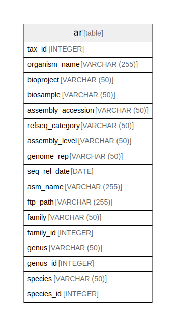

# ar_refseq.sqlite

## Tables

| Name | Columns | Comment | Type |
| ---- | ------- | ------- | ---- |
| [ar](ar.md) | 17 |  | table |

## Relations

---

> Generated by [tbls](https://github.com/k1LoW/tbls)
