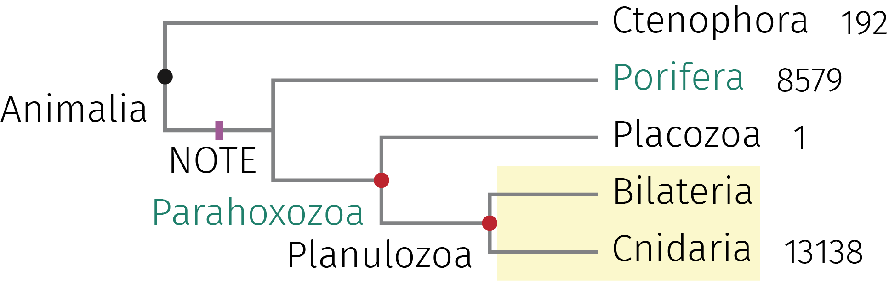
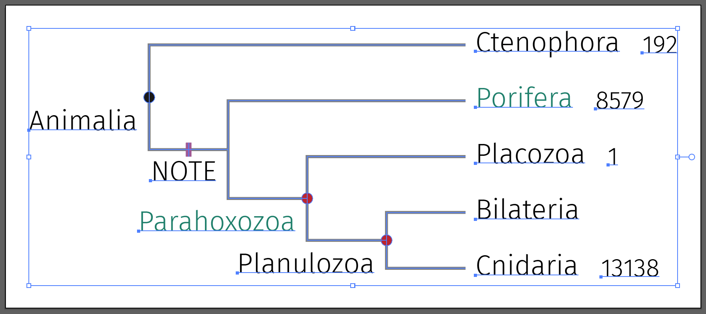

# Create cladogram/phylogram from newick via xelatex/tikz/forest

## A picture is worth a thousand words



## Why not FigTree/Dendroscope/MEGA?

Full control over the trees: fonts, colors, line widths, annotations, and more. And, the process can
be recorded.

Below is the resulting file opened in Adobe Illustrator.

This is a very clean vector graphics in which all text would be editable.



## Start from scratch

* Let's start by manually entering some basal taxa of animals

```shell
cat <<'EOF' > newick/example.nwk
(Ctenophora,(Porifera,(Placozoa,(Bilateria,Cnidaria))))Animalia;
EOF

nwr viz indent --text '.   ' newick/example.nwk

```

* You can verify it with your eyes

```text
(
.   Ctenophora,
.   (
.   .   Porifera,
.   .   (
.   .   .   Placozoa,
.   .   .   (
.   .   .   .   Bilateria,
.   .   .   .   Cnidaria
.   .   .   )
.   .   )
.   )
)Animalia;
```

* Add more information to comments
    * One node at a time

```shell
cat newick/example.nwk |
    nwr viz comment stdin --node Ctenophora --comment 192  |
    nwr viz comment stdin --node Porifera --color green --comment 8579 |
    nwr viz comment stdin --node Placozoa --comment 1 |
    nwr viz comment stdin --node Cnidaria --comment 13138 |
    nwr viz comment stdin --lca Bilateria,Cnidaria --label Planulozoa --dot red --rec LemonChiffon |
    nwr viz comment stdin --lca Bilateria,Placozoa --label Parahoxozoa --color green --dot red |
    nwr viz comment stdin --lca Bilateria,Porifera --label NOTE --bar purple |
    nwr viz indent stdin |
    tee newick/example.comment.nwk
#(
#  Ctenophora[comment=192],
#  (
#    Porifera[color=green:comment=8579],
#    (
#      Placozoa[comment=1],
#      (
#        Bilateria,
#        Cnidaria[comment=13138]
#      )[label=Planulozoa:dot=red]
#    )[label=Parahoxozoa:color=green:dot=red]
#  )[label=NOTE:bar=purple]
#)Animalia;

```

* Newick file is converted to `forest` codes

```shell
nwr viz tex newick/example.comment.nwk --bare
#[, dot, label={Animalia}, tier=4,
#  [{Ctenophora}, comment={192}, tier=0,]
#  [, bar={purple}, label={NOTE}, tier=3,
#    [\color{green}{Porifera}, comment={8579}, tier=0,]
#    [, dot={red}, label=\color{green}{Parahoxozoa}, tier=2,
#      [{Placozoa}, comment={1}, tier=0,]
#      [, dot={red}, rec={LemonChiffon}, label={Planulozoa}, tier=1,
#        [{Bilateria}, tier=0,]
#        [{Cnidaria}, comment={13138}, tier=0,]
#      ]
#    ]
#  ]
#]

```

* Produce pdf
    * Edit the .tex file as you wish

```shell
nwr viz tex newick/example.comment.nwk -s -o tex/example.tex

tectonic tex/example.tex --outdir pdf

```

## From a Newick file

### hg38.30way

```shell
curl -L https://hgdownload.cse.ucsc.edu/goldenpath/hg38/multiz30way/hg38.30way.scientificNames.nh \
    > newick/hg38.30way.nwk

cat newick/hg38.30way.nwk |
    nwr viz comment stdin --lca Homo_sapiens,Nomascus_leucogenys --label Hominoidea --dot --rec LemonChiffon |
    nwr viz comment stdin --lca Macaca_mulatta,Rhinopithecus_roxellana --label Cercopithecidae  --dot --rec TeaRose |
    nwr viz comment stdin --lca Callithrix_jacchus,Aotus_nancymaae --label Cebidae --dot --rec Celadon |
    nwr viz tex stdin --bl -s -o tex/hg38.30way.tex

tectonic tex/hg38.30way.tex --outdir pdf

```

### Opisthokonta

Create `Opisthokonta.nwk` manually

```shell
cat newick/Opisthokonta.nwk |
    nwr viz comment stdin -n Fungi -n Metazoa --color red |
    nwr viz comment stdin -n Holomycota --rec TeaRose |
    nwr viz comment stdin -n Choanozoa --rec ElectricBlue |
    nwr viz tex stdin -s -o tex/Opisthokonta.tex

tectonic tex/Opisthokonta.tex --outdir pdf

```

## From taxonomy

### Algae

```shell
cd ~/Scripts/nwr/tree/

nwr viz common \
    "Cyanobacteria" \
    "Euglenida" \
    "Kinetoplastea" \
    "Dinophyceae" \
    "Apicomplexa" \
    "Ciliophora" \
    "Haptophyta" \
    "Cryptophyceae" \
    "Chrysophyceae" \
    "Bacillariophyta" \
    "Rhodophyta" \
    "Chlorophyta" \
    "Phaeophyceae" |
    sed 's/cellular organisms//g' |
    sed 's/\broot\b//g' |
    nwr viz tex stdin -s -o tex/Algae.tex

tectonic tex/Algae.tex --outdir pdf

```

### Plants

```shell
cd ~/Scripts/nwr/tree/

nwr viz common \
    "Anthocerotophyta" \
    "Bryophyta" \
    "Marchantiophyta" \
    \
    "Tracheophyta" \
    \
    "Lycopodiopsida" \
    "Euphyllophyta" \
    "Polypodiopsida" \
    \
    "Acrogymnospermae" \
    "Cycadopsida" \
    "Ginkgoopsida" \
    "Gnetopsida" \
    "Pinopsida" \
    \
    "Spermatophyta" \
    "Amborellales" \
    "Nymphaeales" \
    "Austrobaileyales" \
    "Mesangiospermae" \
    "Magnoliidae" \
    "Liliopsida" \
    "eudicotyledons " \
    "asterids" \
    "rosids" |
    sed 's/\broot\b//g' |
    nwr viz tex stdin -s -o tex/Plants.tex

tectonic tex/Plants.tex --outdir pdf

```

## From a `forest` file

### animals

```shell
# animals-simple
nwr viz tex forest/animals-simple.forest --forest -s -o tex/animals-simple.tex

tectonic tex/animals-simple.tex --outdir pdf

# animals-simple.trans
cat tex/animals-simple.tex |
    sed -f translation.sed \
    > tex/animals-simple.trans.tex

tectonic tex/animals-simple.trans.tex --outdir pdf

```

### chordates

```shell
nwr viz tex forest/chordates.forest --forest -s -o tex/chordates.tex

cat tex/chordates.tex |
    sed -f translation.sed \
    > tex/chordates.trans.tex

tectonic tex/chordates.trans.tex --outdir pdf

```

### Vertebrate

```shell
nwr viz tex forest/Vertebrate.forest --forest -s -o tex/Vertebrate.tex

tectonic tex/Vertebrate.tex --outdir pdf

```

## From seqs

```shell
iqtree2 -s seqs/vet.fa -st MORPH -m MK -b 100

nwr viz reroot seqs/vet.fa.contree -n Lamprey |
    nwr viz tex stdin -s |
    tectonic - --outdir pdf

mv pdf/texput.pdf pdf/vet.fa.pdf

```

## Taxonomy

## Translation

* Create `translation.tsv` manually

* Convert .tsv to sed scripts

```shell
# sed scripts
cat translation.tsv |
    grep -v "^#" |
    grep "." |
    perl -nla -F"\t" -e '
        print q(s/{) . $F[0] . q(}/{) . $F[1] . q(}/g;);
    ' \
    > translation.sed

cat translation.tsv |
    grep -v "^#" |
    grep "." |
    perl -nla -F"\t" -e '
        print q(s/{) . $F[0] . q(}/{) . $F[0] . q( \\\\footnotesize{) . $F[1] . q(}}/g;);
    ' \
    > translation.append.sed

```

```shell
# replaced with translations
cat tex/example.tex |
    sed -f translation.sed \
    > tex/example.trans.tex

tectonic tex/example.trans.tex --outdir pdf

# append translations
cat tex/example.tex |
    sed -f translation.append.sed \
    > tex/example.trans.append.tex

tectonic tex/example.trans.append.tex --outdir pdf

```
